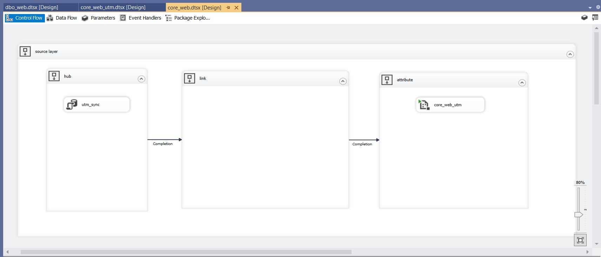

## Автоматизация разработки SSIS пакета

### Описание проблемы

Для написания ssis-пакета для прогрузки атрибутов сущности уходит довольно много времени при этом код достаточно простой и на первый взгляд поддается автогенерированию. Общая структура ssis-пакета выглядит следующим образом 


### Варианты решения 

Для начала напишем простой biml-script, на вход которому будем давать список атрибутов сущности. А на выходе получать ssis-пакета для прогрузки.

### Реализация

Добавим с код генерации объектов сущности в хранилище следующие строки для генерации списка

```c#
string list_for_ssis = "";
foreach (KeyValuePair<string, string> kvp in dict_attr)
{
if (bk.Contains(kvp.Key)) continue;
list_for_ssis += "\"" + kvp.Value + "\", \r";
}
File.WriteAllText(dir + "\\template\\list_for_ssis.txt", list_for_ssis);
```

В результате получим список, который добавим в biml-script

```c#
<#@ template language="C#" hostspecific="true"#>
<#@ import namespace="System.Data" #>
<# string[] array = new[] {
                            "traffic_type", 
                            "traffic_category", 
                            "traffic_subcategory", 
                            "traffic_division", 
                            "traffic_channel", 
                            "traffic_is_paid", 
                            "campaign_target_category_id", 
                            "campaign_target_web_level_1", 
                            "campaign_target_web_level_2", 
                            "campaign_target_web_level_3", 
                            "campaign_target_web_level_4", 
                            "campaign_target_web_level_5", 
                            "campaign_target_web_level_6"
                            }; #>
<Biml xmlns="http://schemas.varigence.com/biml.xsd">
<Connections>
    <Connection Name="MDWH" CreateInProject="true" ConnectionString="Data Source=dwh.prod.lan;Initial Catalog=MDWH;Provider=SQLNCLI11.1;Integrated Security=SSPI;Auto Translate=False;" />
</Connections>
  <Packages>
    <Package Name="core_web_utm_extended" ConstraintMode="Parallel">
      <Tasks>
        <# foreach (var table in array) { #>
        <ExecuteSQL Name="utm_extended_x_<#=table#>_sync" ConnectionName="MDWH" ResultSet="None">
          <DirectInput>exec core.utm_extended_x_<#=table#>_sync;</DirectInput>
        </ExecuteSQL>
        <# } #>
      </Tasks>
    </Package>
  </Packages>
</Biml>
```

Результатом работы скрипта является ssis-пакет, в нашем случае core_web_utm_extended.dtsx. Это пакет после тестирования можно добавить в общий проект.


### Полезные ссылки

- [JSON](https://ru.wikipedia.org/wiki/JSON)