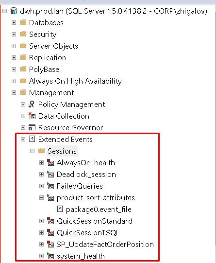

#### [Заметки по Extended Events](./ExtendedEvents_note.md)  

### Мониторинг таблицы

#### Описание проблемы

Иногда появляется вопрос, а кто-нибудь пользуется вообще этой таблицей? Может не стоит грузить сервер для обновления данных в этой таблице?

#### Варианты решения

Первое, что можно сделать - это настроить мониторинг запросов **SELECT** к этой таблице. Для этого используем Extended Events.



#### Реализация

Настроить событие Extended Events можно двумя способами: с помощью пользовательского интерфейса SSMS и с помощью инструкции T-SQL. Обе реализации описаны в [документации](https://docs.microsoft.com/ru-ru/sql/relational-databases/extended-events/quick-start-extended-events-in-sql-server?view=sql-server-ver15). Так для отслеживания таблицы product_sort_attributes нужно использовать событие **sql_statement_completed** и следующий шаблон

```sql
N'%select%product_sort_attributes%'
```

для поля sqlserver.sql_text в настройках фильтра.

После сбора данных по событиям, по ним можно сделать дополнительный поиск и фильтрацию. Для этого извлечем информацию о событиях с помощью пользовательского интерфейса SSMS 


Далее настроим столбцы в таблице и наложим фильтр исключающий запросы с самого сервера DWH: SBI-APP-003


В итоге видно, что таблицу скачивают по запросу

```sql
select * from MDWH.marketing.product_sort_attributes with (nolock)
```

под учёткой MdwhReader
с серверов MLB-SDB-005 и MLB-SDB-007

#### Полезные ссылки:  

- [Database alias in Microsoft SQL Server](https://www.baud.cz/blog/database-alias-in-microsoft-sql-server)  
- [mssqltips.com - SQL Server Extended Events Tutorial](https://www.mssqltips.com/sqlservertutorial/9194/sql-server-extended-events-tutorial/)  
- [Capture Executions of Stored Procedures in SQL Server](https://www.mssqltips.com/sqlservertip/6550/capture-executions-of-stored-procedures-in-sql-server/)  

