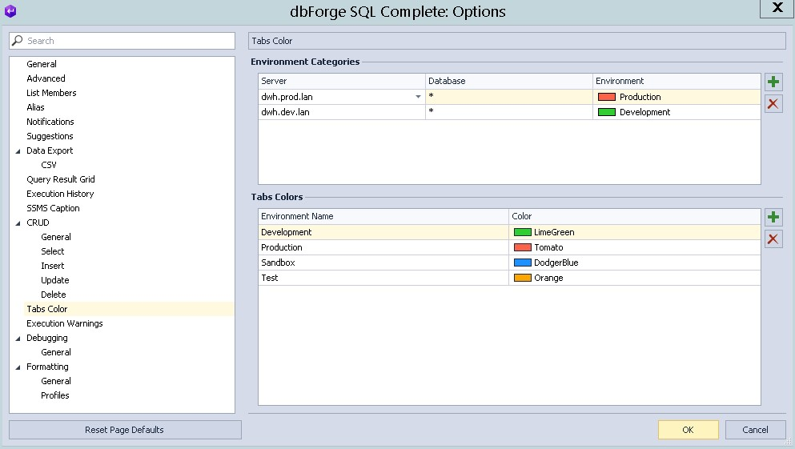

# Подсветка окна запроса

Очень часто бывает, что нужно переключаться между окнами запросов к разным средам (DEV, PROD). Чтобы легче было ориентироваться, в плагине **[SQL Complete](https://www.devart.com/dbforge/sql/sqlcomplete/)** можно настроить цвета для каждой среды.

### Полезные ссылки:  

- [SQL Complete - Documentation](https://docs.devart.com/sqlcomplete/?_ga=2.254699784.1204679796.1625145719-196676643.1615546694)  
- [SQL Complete - Video](https://www.devart.com/dbforge/sql/sqlcomplete/resources.html)  