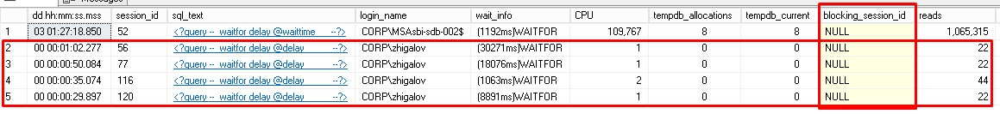
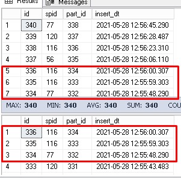

### [Заметки по SQL Server](../SQLServer_note.md)  

## Параллельное удаление строк в таблице

### Описание проблемы  

Для организации параллельной прогрузки данных по задаче [Обновление значений в больших таблицах](../Update_Big_Table/Update_Big_Table.md) есть идея организовать параллельное удаление строк в таблице [core].[item_snapshot_item_key]. 

### Решение  

- Выделить большие куски данных, чтобы не было взаимных блокировок.  
- Или можно создать таблицу, которая логирует удаляемые данные. Это позволит динамически изменять количество процессов для удаления.

### Реализация  

- Реализуем формирование логирования или карты того, какой кусок таблицы какой процесс обрабатывает.  

  Создадим таблицу для формирования карты задач для параллельных сессий.

  ```sql
  -- карта задач
  -- drop table [core].[item_snapshot_map_of_tasks]
  create table [core].[item_snapshot_map_of_tasks] (
  	id int not null identity(1,1),
  	spid int default @@spid,
  	part_id int,
  	insert_dt datetime
  	)
  ```

  Далее напишем процедуру для параллельного запуска.

  ```sql
  -- exec core.item_snapshot_map
  
  alter proc core.item_snapshot_map
  as
  
  declare @part_id int = 0, @part_cnt int = 1000, @time int, @delay nvarchar(8)
  
  while @part_cnt > @part_id 
  begin
  	begin try
  		begin tran
  			set @part_id = 1 + 
  				(select isnull(max(part_id), 0) from [core].[item_snapshot_map_of_tasks] (nolock))
  			
  			insert into [core].[item_snapshot_map_of_tasks] 
  				(
  				[part_id]
  				,[insert_dt]
  				)
  			select @part_id, getdate()
  
  			if (select spid
  				from (select spid, row_number() over (partition by part_id order by id) rn
  						from [core].[item_snapshot_map_of_tasks] (nolock)
  						where part_id = @part_id
  						) t
  				where rn = 1) <> @@spid
  
  				THROW 51000, 'The part_id already exists', 1
  
  			else 
  				begin
  					set @time = 59*rand()
  					set @delay = '00:00:' + case 
  												when len(cast(@time as nvarchar(2))) = 2 
  														then cast(@time as nvarchar(2))
  														else '0' + cast(@time as nvarchar(2)) 
  												end
  					-- время на выполнение задачи
  					waitfor delay @delay
  
  					commit tran
  				end
  	end try
  	begin catch
  
  		-- select @@trancount
  		if @@trancount > 0
  			rollback tran
  
  	end catch
  
  end
  ```

  Запустим параллельно **exec core.item_snapshot_map** в четырех сессиях и посмотрим есть ли взаимные блокировки **exec sp_whoisactive**  

  
  
  Сравним результаты запросов к [core].[item_snapshot_map_of_tasks] с разными уровнями изоляции
  
  ```sql
  select * 
  from [core].[item_snapshot_map_of_tasks] (nolock) -- или (readuncommitted)
  order by insert_dt desc
  
  select * 
  from [core].[item_snapshot_map_of_tasks] (readcommitted)
  order by insert_dt desc
  ```
  
  
  
  Остановим работу сессий. После остановки в SQL Server Management Studio нужно откатить открытые транзакции
  
  ```sql
  -- select @@trancount
  if @@trancount > 0
      rollback tran
  ```
  
  Проверим таблицу [core].[item_snapshot_map_of_tasks] на дубликаты задач
  
  ```sql
  -- проверка на дубликаты задач
  select *
  from
  	(
  		select *, row_number() over (partition by part_id order by id) rn
  		from [core].[item_snapshot_map_of_tasks]
  	) t
  where rn > 1
  ```
  
  Всё хорошо, возвращается ноль строк!  
  
- Следующим шагом собственно добавим обработку задачи: удаление строк из таблицы.  

  Для дополнительного контроля добавим таблицу [core].[item_snapshot_errors]

  ```sql
  create table [core].[item_snapshot_errors] (
  	id int not null identity(1,1),
  	spid int default @@spid,
  	part_id int,
  	ErrorNumber int,
  	ErrorProcedure nvarchar(255),
  	ErrorLine int,
  	ErrorMessage nvarchar(255),
  	insert_dt datetime
  	)
  ```

  Модифицированный скрипт для проверки логирования ошибок дублирования задач приложен в исходниках ниже.

  При параллельном удалении данных из таблицы возникают взаимные блокировки, даже если диапазоны не пересекаются. Партиционирование не спасает от блокировок. Возможно, уменьшить количество блокировок поможет снятие эскалации блокировок.

  ```sql
  alter table [core].[item_snapshot_item_key]
  set (LOCK_ESCALATION = DISABLE)
  
  select name, lock_escalation_desc
  from sys.tables
  where name = 'item_snapshot_item_key'
  ```

  Для задачи параллельной обработки массива строк поможет создание дополнительной таблицы для проверки 

  ```sql
  create table [core].[item_snapshot_item_key_check](
  	[item_key] [bigint] NOT NULL
  )
  ```

- После параллельной обработки нужно проверить расхождения с [core].[item_snapshot_item_key_check]. Если есть расхождение, то это значит были rollback tran из-за взаимных блокировок или других ошибок (возможно останавливали выполнение в SQL Server Management Studio)

  ```sql
  select sum(src_cnt) as src_cnt, sum(check_cnt) as check_cnt, sum(src_cnt) - sum(check_cnt) as diff
  from
  (
  select 0 as src_cnt, count(*) check_cnt
  from [core].[item_snapshot_item_key_check]
  union all
  select count(*) cnt, 0
  from [core].[item_snapshot_item_key]
  ) t
  ```

  Поэтому нужно выяснить какие части таблицы остались необработанные. Как правило, это малая часть может быть быстро обработана последовательно

  ```sql
  select [item_key]
  from [core].[item_snapshot_item_key] src
  where not exists (select top (1) 1
  					from [core].[item_snapshot_item_key_check] tgt 
  					where tgt.[item_key] = src.item_key)
  ```

  Для этого напишем процедуру core.item_snapshot_tail  

### Вывод  

Для организации параллельной загрузки данных лучше писать обработанный кусок данных в новую таблицу, а не удалять их из общей таблицы. Итоговый скрипт [core.item_snapshot_map.sql](./rand_process/core.item_snapshot_map.sql.md) можно использовать как шаблон для организации параллельной обработки любых задач.

### Исходный код скриптов  

Заранее определяем диапазон для удаления каждому процессу : [core.item_snapshot_N1.sql](./fix_process/core.item_snapshot_N1.sql.md), [core.item_snapshot_N2.sql](./fix_process/core.item_snapshot_N2.sql.md)

Динамическое распределение диапазона данных по процессам : 

- для инициализации и мониторинга - [scripts_init_monitoring.sql](./rand_process/scripts_init_monitoring.sql.md), 
- для параллельной обработки - [core.item_snapshot_map.sql](./rand_process/core.item_snapshot_map.sql.md), 
- для завершающей обработки, если остались необработанные диапазоны - [core.item_snapshot_tail.sql](./rand_process/core.item_snapshot_tail.sql.md)

### Полезные ссылки:  

- [Running parallel delete statements](https://dba.stackexchange.com/questions/56432/running-parallel-delete-statements)  
- [Minimally Logging Bulk Load Inserts into SQL Server](https://www.mssqltips.com/sqlservertip/1185/minimally-logging-bulk-load-inserts-into-sql-server/)  