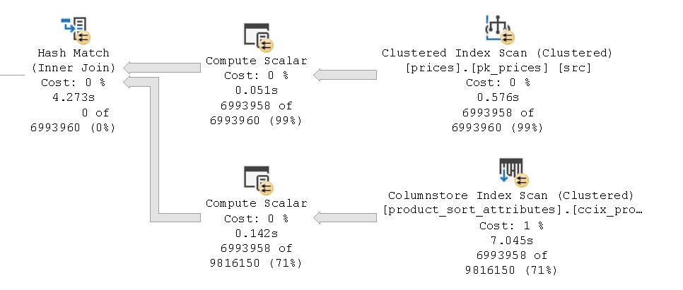
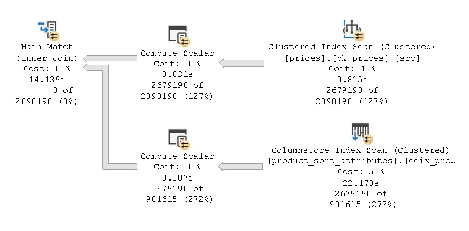
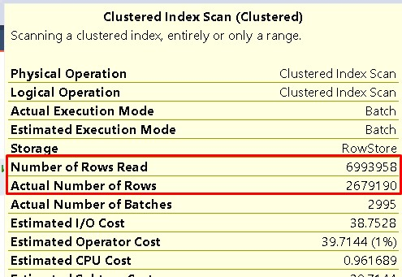
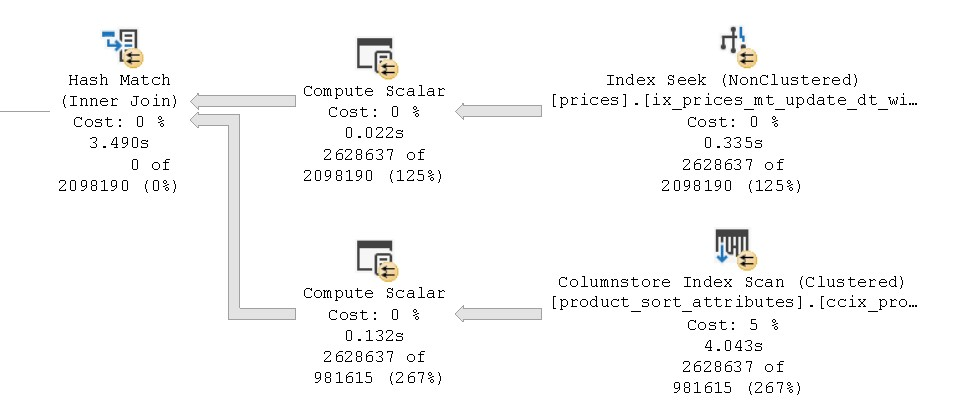
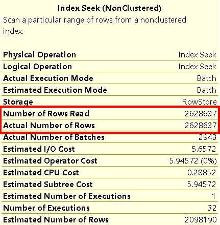

## Извлечение данных из больших и быстро растущих таблиц при формировании витрин

### Описание проблемы

При обновлении полей данных для витрин приходится использовать большие таблицы. Например

```sql
update tgt
set
	tgt.delivery_time = src.delivery_days,
	tgt.offers_count = src.total_offers
from
	dbo.product_sort_attributes as tgt
	inner join core.prices as src on
		tgt.item_key = src.item_key
where
	not (
		isnull(cast(tgt.delivery_time as nvarchar), '') = isnull(cast(src.delivery_days as nvarchar), '')
		and isnull(cast(tgt.offers_count as nvarchar), '') = isnull(cast(src.total_offers as nvarchar), '')
	)
```



```sql
Table 'prices'. Scan count 33, logical reads 53078
```

Как видим, из таблицы **core.prices** извлекаются почти все данные, хотя с последнего обновления измененных строк может быть очень мало!!! Возникает задача, считывать только измененные строки.

### Варианты решения

Для вычисления измененных строк с последнего обновления витрины плюс новых (delta), договоримся добавлять в таблицы следующие столбцы с метаданными: **mt_insert_dt, mt_update_dt**.

Для упрощения вычисления delta, договоримся при вставки новой строки также проставлять дату **mt_update_dt**. Тогда новые строки можно вычислять по условию mt_insert_dt > даты последнего обновления. А delta (новые строки + измененные) можно вычислять по условию mt_update_dt > даты последнего обновления.

Для простоты реализации подхода, пока договоримся не фиксировать дату последнего обновления, а брать лаг от текущего момента в 6 дней

```sql
declare @mt_dt datetime2(0) = sysdatetime()				-- для проставления mt_insert_dt, mt_update_dt
declare @load_dt datetime2(0) = dateadd(dd, -6, @mt_dt) -- для вычисления delta

-- вычисляем новые записи
select *
from core.prices
where mt_insert_dt > @load_dt

-- вычисляем delta
select *
from core.prices
where mt_update_dt > @load_dt
```

В дальнейшем, для оптимизации работы DWH можно записывать время последнего обновления в таблицу с метаданными metadata.table_update_dt (table_name, column_name, update_dt). 

Стоит также отметить **момент с обновлением новых данных для самой витрины**. Например в DWH c даты последнего обновления появился item_key = NXYZ, которого до этого не было. Возникает вопрос, обновим ли мы нашей delta поле витрины для item_key = NXYZ ? 

Если взять за основу, что все слои хранилища обновляются последовательно и обновление слоя "DATAMART" (в нашем случае это схема dbo) начинается только после обновления слоя "CORE", то конечно да, обновится. Так как этот item_key = NXYZ попадём после последнего обновления витрины, запишется во все таблицы слоя "CORE" и так как при вставки новой строки мы проставляем датой сразу два поля (mt_insert_dt, mt_update_dt), то по условию mt_update_dt > @load_dt мы отберем все новые item_key.

Если же слои могут обновляться параллельно, то может возникнуть ситуация, когда item_key = NXYZ уже попал в витрину, но ещё не успел записаться в таблицу, по которой выполняется вычисление. Тогда в это обновление витрины, соответствующий столбец для item_key = NXYZ останется пустым (NULL). Но этот столбец обновится при следующем обновлении. Поэтому беспокоится не о чем, но нужно предусмотреть в процедуре формирования витрины случай, когда это поле NULL.

Также можно предположить, что item_key = NXYZ не сразу попал в витрину, то есть на момент последнего обновления витрины item_key = NXYZ уже был в таблице слоя "CORE", но не было в витрине. Тогда при следующем обновлении витрины, когда item_key = NXYZ в неё попадет. **В delta уже не будет соответствующей строки для вычисления.**

Остается ещё один вопрос. А во все ли таблицы слоя "CORE" попадёт новый item_key = NXYZ. Тут нужно понимать, какая таблица как формируется и исходить из этого. По методологии Data Vault в Спутниках (Satellite) должны быть все сущности, которые есть в его Хабе (Hub). Но при этом в соответствующих Связях (Link) каких-то сущностей может не быть. Или быть, но со "старыми" значениями другой сущности.

Таким образом, мы подошли к выводу, что столбец для нового item_key = NXYZ будет гарантированно вычислен на основе delta, только если этот столбец вычисляется на атрибутах той же сущности, что и витрина. Если же у нас идет вычисление на основе дынных другой сущности и используется Связь (Link), то тут нужно создавать дополнительные конструкции.

### Реализация 

Перепишем наш запрос с использованием delta

```sql
declare @mt_dt datetime2(0) = sysdatetime()				-- для проставления mt_insert_dt, mt_update_dt
declare @load_dt datetime2(0) = dateadd(dd, -6, @mt_dt) -- для вычисления delta

update tgt
set
	tgt.delivery_time = src.delivery_days,
	tgt.offers_count = src.total_offers
from
	dbo.product_sort_attributes as tgt
	inner join core.prices as src on
		tgt.item_key = src.item_key
where
	src.mt_update_dt > @load_dt and
	not (
		isnull(cast(tgt.delivery_time as nvarchar), '') = isnull(cast(src.delivery_days as nvarchar), '')
		and isnull(cast(tgt.offers_count as nvarchar), '') = isnull(cast(src.total_offers as nvarchar), '')
	)
```



```sql
Table 'prices'. Scan count 33, logical reads 53078
```

Видим, что количество извлекаемых строк сократилось, но количество чтений нет. Всё ещё используется scan и читается вся таблица.



Следующим шагом создаем покрывающий индекс

```sql
create nonclustered index [ix_prices_mt_update_dt_with_include] on [core].[prices]
(
[mt_update_dt] asc
)
include (delivery_days, total_offers)
```

После создания индекса в плане запроса операция сканирования меняется на поиск



```sql
Table 'prices'. Scan count 33, logical reads 9722
```

**И количество логических чтений уменьшилось в 5 раз! Важно, что это количество зависит от размера delta и почти не зависит от размера самой таблицы!**



### Вывод

Основной плюс данного подхода, ускорение формирования витрины и снижение нагрузки на дисковую подсистему. 

Минус, что под запрос пришлось создать индекс. Большое количество индексов будет увеличивать время на вставку/обновление данных и повышать нагрузку на дисковую подсистему. 

Для контроля результирующей нагрузки на дисковую подсистему и ускорения работы DWH в целом, необходимо разработать систему мониторинга.

### Полезные ссылки:  

- [Indexing Best Practices](https://www.sqlservercentral.com/steps/sql-server-indexing-best-practices-stairway-to-sql-server-indexes-level-15)  
- [Обзор гибких методологий проектирования DWH](https://habr.com/ru/company/glowbyte/blog/515940/)  