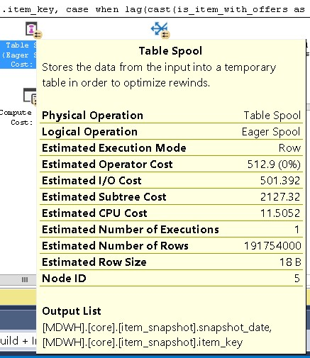

# Обновление значений в больших таблицах  

*[Синтаксис MarkDown](https://www.markdownguide.org/basic-syntax/)*  
[Заметки по SQL Server](../SQLServer_note.md)  

## Описание проблемы  

Есть таблица со снэпшотами (досталось в наследство от предыдущей команды) - core.item_snapshot  

| name          | rows          | reserved           | data           | index_size     | unused   |
| ------------- | ------------- | ------------------ | -------------- | -------------- | -------- |
| item_snapshot | 4 666 894 910 | **289** 292 552 KB | 159 901 536 KB | 129 344 712 KB | 46304 KB |

В эту таблицу нужно добавить вычисление   
**lag(cast(is_item_with_offers as tinyint), 1, 0) over (partition by item_key order by snapshot_date) - cast(is_item_with_offers as tinyint)**  
Вычисление содержит оконную функцию, поэтому добавить его как вычисляемый столбец не получится   

> **Windowed functions can only appear in the SELECT or ORDER BY clauses.**

Обновить простым **update** за один проход не получится по той же причине. Остается только предварительно вычислить значение и сделать **update** в целевой таблице. Но так как таблица очень большая, **join** работает очень медленно, постоянно идёт чтение/запись на жесткий диск.

```sql
with
disappeared as (
	select
		[is].snapshot_date,
		[is].item_key,
			case when 
			lag(cast(is_item_with_offers as tinyint), 1, 0) over (partition by item_key order by snapshot_date) - cast(cast(is_item_with_offers as tinyint) as int) = 1
			then 1 else 0 end 
		as is_item_with_disappeared_offers
	from
		core.item_snapshot as [is]
	where [is].snapshot_date >= '20210201' and [is].snapshot_date < '20210301'
)
update tgt
set
	tgt.is_item_with_disappeared_offers = src.is_item_with_disappeared_offers
from
	core.item_snapshot as tgt
	inner join disappeared src on
		tgt.snapshot_date = src.snapshot_date and tgt.item_key = src.item_key
```



## Решение

Попробовать организовать партиционирование таблицы таким образом, чтобы запрос на обновление отрабатывал без оператора Table Spoon.

- Напишем процедуру обновления (добавления нового) поля для таблицы. Так как у нас вычисление использует оконную функцию Lag c partition by **item_key** order by **snapshot_date**, то для корректного вычисления мы должны затянуть все даты для каждого **item_key**  

```sql
use [MDWH]
go


create nonclustered index [ix_item_snapshot_item_key] on [core].[item_snapshot]
(
[item_key] asc
) 
go

-- вычисление диапазона item_key
select [item_key] into [core].[item_snapshot_item_key] from core.item_snapshot group by [item_key]

-- создание буфера диапазона item_key
select [item_key] into [core].[item_snapshot_item_key_buf] from core.item_snapshot where 1 = 0

-- создание буферной таблицы
select
	[snapshot_date],
	[item_key],
	[offers_count],
	[is_item_with_offers],
	[is_item_with_orders],
	[is_exists_web_level],
	[is_more_than_one_offer],
	[is_new_active_sku]
into [core].[item_snapshot_buf]
from
	core.item_snapshot
where
	1 = 0

-- создание целевой таблицы
create table [core].[item_snapshot_tgt] (
	[snapshot_date] [date] not null,
	[item_key] [bigint] not null,
	[offers_count] [int] not null,
	[is_item_with_offers] [bit] not null,
	[is_item_with_orders] [bit] not null,
	[is_exists_web_level] [bit] not null,
	[is_more_than_one_offer] [bit] not null,
	[is_new_active_sku] [bit] not null,
	[is_item_with_disappeared_offers] [bit] not null
)

-- организация цикла добавления нового поля
declare @cnt int = 1

while @cnt > 0
begin
	-- заполнение буфера диапазона item_key
	delete top (10000) from [core].[item_snapshot_item_key]
	output deleted.[item_key]
	into [core].[item_snapshot_item_key_buf]

	set @cnt = @@ROWCOUNT
	select @cnt

	-- заполнение буферной таблицы
	insert into [core].[item_snapshot_buf]
		(
			[snapshot_date]
			,[item_key]
			,[offers_count]
			,[is_item_with_offers]
			,[is_item_with_orders]
			,[is_exists_web_level]
			,[is_more_than_one_offer]
			,[is_new_active_sku]
		)
	select 	[snapshot_date]
			,sn.[item_key]
			,[offers_count]
			,[is_item_with_offers]
			,[is_item_with_orders]
			,[is_exists_web_level]
			,[is_more_than_one_offer]
			,[is_new_active_sku]						
	from core.item_snapshot sn
		inner join [core].[item_snapshot_item_key_buf] buf on sn.item_key = buf.item_key		

	;
	with
	disappeared as (
		select
			[snapshot_date]
			,[item_key]
			,[offers_count]
			,[is_item_with_offers]
			,[is_item_with_orders]
			,[is_exists_web_level]
			,[is_more_than_one_offer]
			,[is_new_active_sku]
			,case when 
				lag(cast(is_item_with_offers as tinyint), 1, 0) over (partition by item_key order by snapshot_date) - cast(cast(is_item_with_offers as tinyint) as int) = 1
				then 1 
				else 0 
			end as is_item_with_disappeared_offers
		from
			[core].[item_snapshot_buf]
	)
	insert into [core].[item_snapshot_tgt]
		(
			[snapshot_date]
			,[item_key]
			,[offers_count]
			,[is_item_with_offers]
			,[is_item_with_orders]
			,[is_exists_web_level]
			,[is_more_than_one_offer]
			,[is_new_active_sku]
			,[is_item_with_disappeared_offers]
		)
	select 
		[snapshot_date]
		,[item_key]
		,[offers_count]
		,[is_item_with_offers]
		,[is_item_with_orders]
		,[is_exists_web_level]
		,[is_more_than_one_offer]
		,[is_new_active_sku]
		,is_item_with_disappeared_offers
	from disappeared

	-- очистка буферных таблиц
	truncate table [core].[item_snapshot_item_key_buf]
	truncate table [core].[item_snapshot_buf]

end

drop index [ix_item_snapshot_item_key] on [core].[item_snapshot]
go
```

Подбираем размер буферной таблицы **[core].[item_snapshot_item_key_buf]** таким образом, чтобы в плане запроса не возникало оператора **Table Spoon**. 

- Следующим шагом напишем функцию и схему партиционирования по дням **snapshot_date**

```sql
-- вычисление списка дат
select [snapshot_date] into [core].[item_snapshot_item_snapshot_date] from core.item_snapshot group by [snapshot_date]

declare @list_dt nvarchar(4000) = ''''
select top (300)
	@list_dt = ''',''' + cast([snapshot_date] as nvarchar(10)) + @list_dt
from
	[core].[item_snapshot_item_snapshot_date]
order by
	[snapshot_date] desc

select @list_dt = substring(@list_dt, 3, len(@list_dt))
--select @list_dt

--DROP PARTITION SCHEME ps_item_snapshot
--DROP PARTITION FUNCTION pf_item_snapshot

declare @sql nvarchar(4000)
--Таблица или индекс в SQL Server могут содержать до 15 000 секций.
set @sql =
'CREATE PARTITION FUNCTION [pf_item_snapshot] (DATE)
AS RANGE RIGHT FOR VALUES 
(' + @list_dt + ')'

exec sp_executesql
	@sql

CREATE PARTITION SCHEME ps_item_snapshot
AS PARTITION pf_item_snapshot
ALL TO ('STAT');

--drop table if exists [core].[item_snapshot_tgt]
create table [core].[item_snapshot_tgt] (
	[snapshot_date] [date] not null,
	[item_key] [bigint] not null,
	[offers_count] [int] not null,
	[is_item_with_offers] [bit] not null,
	[is_item_with_orders] [bit] not null,
	[is_exists_web_level] [bit] not null,
	[is_more_than_one_offer] [bit] not null,
	[is_new_active_sku] [bit] not null,
	[is_item_with_disappeared_offers] [bit] not null
) ON ps_item_snapshot (snapshot_date)

```
declare @list_dt nvarchar(4000) имеет ограничение по длине. Для обхода этого можно использовать курсор

```sql

-- вычисление списка дат
select [snapshot_date] 
into [core].[item_snapshot_item_snapshot_date] 
from core.item_snapshot 
group by [snapshot_date]

--Таблица или индекс в SQL Server могут содержать до 15 000 секций.
--Создание функции партиционирования
--drop PARTITION FUNCTION pf_test
create partition function pf_test (date)
as range right for values ('1900-01-01')

declare @sql nvarchar(4000),
		@dt nvarchar(10)

declare cursor_snapshot_date cursor
for
 select cast([snapshot_date] as nvarchar(10))
 from [core].[item_snapshot_item_snapshot_date]
 where [snapshot_date] >= '20200101'
 order by [snapshot_date]

open cursor_snapshot_date
fetch next from cursor_snapshot_date into @dt
while @@FETCH_STATUS = 0
begin
	set @sql =
	'ALTER PARTITION FUNCTION pf_test ()
	SPLIT RANGE (''' + @dt + ''')'
	--select @sql
	exec sp_executesql @sql

	fetch next from cursor_snapshot_date into @dt
end
close cursor_snapshot_date
deallocate cursor_snapshot_date

alter partition function pf_test ()
split range ('' + cast(cast(dateadd(d, 1, getdate()) as date) as nvarchar(10)) + '')

-- Посмотрим что получилось
select prv.*
from sys.partition_functions as pf
	left join sys.partition_range_values as prv on
		prv.function_id = 65547

```

Статистику можно посмотреть с помощью запроса

```sql
select partition_id, index_id, partition_number, Rows
FROM sys.partitions
WHERE OBJECT_NAME(OBJECT_ID) = 'item_snapshot_tgt'

-- Итоговая статистика
exec sp_spaceused @objname = N'core.item_snapshot_tgt', @updateusage = N'TRUE';
```

Или более информативный запрос

```sql

SELECT
    sc.name + N'.' + so.name as [Schema.Table],
    si.index_id as [Index ID],
    si.type_desc as [Structure],
    si.name as [Index],
    stat.row_count AS [Rows],
    stat.in_row_reserved_page_count * 8./1024./1024. as [In-Row GB],
    stat.lob_reserved_page_count * 8./1024./1024. as [LOB GB],
    p.partition_number AS [Partition #],
    pf.name as [Partition Function],
    CASE pf.boundary_value_on_right
        WHEN 1 then 'Right / Lower'
        ELSE 'Left / Upper'
    END as [Boundary Type],
    prv.value as [Boundary Point],
    fg.name as [Filegroup]
FROM sys.partition_functions AS pf
JOIN sys.partition_schemes as ps on ps.function_id=pf.function_id
JOIN sys.indexes as si on si.data_space_id=ps.data_space_id
JOIN sys.objects as so on si.object_id = so.object_id
JOIN sys.schemas as sc on so.schema_id = sc.schema_id
JOIN sys.partitions as p on 
    si.object_id=p.object_id 
    and si.index_id=p.index_id
LEFT JOIN sys.partition_range_values as prv on prv.function_id=pf.function_id
    and p.partition_number= 
        CASE pf.boundary_value_on_right WHEN 1
            THEN prv.boundary_id + 1
        ELSE prv.boundary_id
        END
        /* For left-based functions, partition_number = boundary_id, 
           for right-based functions we need to add 1 */
JOIN sys.dm_db_partition_stats as stat on stat.object_id=p.object_id
    and stat.index_id=p.index_id
    and stat.index_id=p.index_id and stat.partition_id=p.partition_id
    and stat.partition_number=p.partition_number
JOIN sys.allocation_units as au on au.container_id = p.hobt_id
    and au.type_desc ='IN_ROW_DATA' 
        /* Avoiding double rows for columnstore indexes. */
        /* We can pick up LOB page count from partition_stats */
JOIN sys.filegroups as fg on fg.data_space_id = au.data_space_id
where so.object_id=object_id('core.item_snapshot_tgt')
ORDER BY [Schema.Table], [Index ID], [Partition Function], [Partition #];

```

- Далее нужно подумать, как мы будем добавлять новые партиции и удалять/объединять старые.

> Всегда оставляйте пустые секции в начале и в конце диапазона секционирования. Это гарантирует отсутствие любого перемещения данных при разбиении секций и их слиянии. Разбиение секций возникает в начале, а слияние секций возникает в конце. Избегайте разбиения или слияния заполненных секций.

> Чтобы переключить несекционированную непустую таблицу в секцию секционированной таблицы, на таблице-источнике обязательно нужны ограничения, чтобы SQL Server знал, что всё будет хорошо и переключение можно сделать как операцию над метаданными


- Проведем анализ, как эффективнее использовать буффер в процедуре выше. Через табличную переменную или через обычную таблицу.  

  Создадим таблицу для логирования и запрос

  ```sql
  create table [core].[item_snapshot_log] (
  	iter_number int,
  	deleted_item_key_count int,
  	inserted_item_snapshot_tgt int,
  	comment nvarchar(100),
  	insert_dt datetime
  	)
  	
  -- Запрос
  with cte as
  (
  select row_number() over (partition by iter_number order by insert_dt desc) rn,
  datediff(ms, lag(insert_dt, 1) over (partition by iter_number order by insert_dt), insert_dt) diff_dt, 
  cast(inserted_item_snapshot_tgt as float)/datediff(ms, lag(insert_dt, 1) over (partition by iter_number order by insert_dt), insert_dt) speed,
  *
  from [core].[item_snapshot_log] (nolock)
  where comment = 'commit' or comment = 'calc disappeared'
  )
  select *
  from cte
  where rn = 1
  order by insert_dt desc
  ```

  Получилось, что использование обычной таблицы (куча) эффективнее. И скорость передачи растет с увеличением буфера:  

  - при буфере диапазона item_key = 1000 - скорость 30 строк с секунду за 1 мин  
  - при буфере диапазона item_key = 100000 - скорость 150 строк с секунду за 5 мин   
  - при буфере диапазона item_key = 1000000 - скорость 200 строк с секунду за 40 мин   
  
- Сравним работу типичного запроса на партиционированной таблице и без партиционирования.  

  ```sql
  set statistics io on
  set statistics time on
  
  select
  	*
  from
  	core.item_snapshot
  where
  	snapshot_date between '20210213' and '20210224'
  	and item_key = 1588179
  
  set statistics io off 
  set statistics time off 
  ```

  для партиционированной

  ```sql
  (12 rows affected)
  Table 'item_snapshot'. Scan count 12, logical reads 312807, physical reads 0, read-ahead reads 0, lob logical reads 0, lob physical reads 0, lob read-ahead reads 0.
  ```

  без партиционирования

  ```sql
  (12 rows affected)
  Table 'item_snapshot'. Scan count 33, logical reads 461307, physical reads 0, read-ahead reads 136574, lob logical reads 0, lob physical reads 0, lob read-ahead reads 0.
  ```

  Видно, что для таблицы без партиционирования больше **logical reads** (думаю, что это из-за высоты кластерного индекса) и **read-ahead reads** очень большое.

  При этом Server подсказывает создать индекс 

  ```sql
  create nonclustered index [ix_item_snapshot_item_key] on [core].[item_snapshot]
  (
  [item_key] asc,
  [snapshot_date] asc
  )
  go
  ```

  Так как у нас уже сделано партиционирование по [snapshot_date], то заменим текущий индекс 

  ```sql
  alter table [core].[item_snapshot] add constraint [pk_item_snapshot] primary key clustered
  (
  [snapshot_date] asc,
  [item_key] asc
  )
  go
  ```

  Размер индекса можно посмотреть с помощью запроса

  ```sql
  select
  	tn.[name]					  as [Table name],
  	ix.[name]					  as [Index name],
  	sum(sz.[used_page_count]) * 8 as [Index size (KB)]
  from
  	sys.dm_db_partition_stats as sz
  	inner join sys.indexes as ix on
  		sz.[object_id] = ix.[object_id] and
  		sz.[index_id] = ix.[index_id]
  	inner join sys.tables tn on
  		tn.OBJECT_ID = ix.object_id
  where ix.[name] = N'ix_item_snapshot_item_key'
  group by tn.[name], ix.[name]
  ```

  После замены индекса стоимость запроса значительно улучшилась

  ```sql
  (12 rows affected)
  Table 'item_snapshot'. Scan count 12, logical reads 36, physical reads 2, read-ahead reads 0, lob logical reads 0, lob physical reads 0, lob read-ahead reads 0.
  ```

  logical reads **36**, physical reads 2, read-ahead reads 0,

## Распараллеливание прогрузки данных

При переносе изменений на проде, скрипт [fill_disappeared_offers.sql](./fill_disappeared_offers.sql.md) скрипт не успел отработать в технологическое окно (12 часов). Отработало только 1/5 всего объема данных. Поэтому возникла задача оптимизировать прогрузку. Одна из идей, это организовать параллельную обработку данных, задача [Параллельное удаление строк в таблице](../Delete_parallel/Delete_parallel.md) На основе этого шаблона напишем наши скрипты. 

- для инициализации - [scripts_init.sql](./parall/scripts_init.sql.md)  
- процедура для параллельной обработки - [core.item_snapshot_map.sql](./parall/core.item_snapshot_map.sql.md)  
- для завершающей обработки - [core.item_snapshot_tail.sql](./parall/core.item_snapshot_tail.sql.md)  
- для мониторинга - [scripts_monitoring.sql](./parall/scripts_monitoring.sql.md)  

Проведем анализ зависимости средней скорости вставки данных от количества сессий в **Dev среде**

| Кол-во сессий | Скорость (тыс. строк в секунду) | TabLock |
| ------------- | ------------------------------- | ------- |
| 1             | 100                             | YES     |
| 2             | 115                             | YES     |
| 4             | 115                             | YES     |

При увеличении количества параллельно работающих сессий время выполнения шага на вставку и извлечение данных увеличивается. Причем доля шага на извлечение данных падает, а доля на вставку в итоговую таблицу растёт. Взаимных блокировок между сессиями не наблюдается. При 4-х сессиях время на извлечение данных сравнялось с временем на вставку (1 транзакция вставляет данные, в то время как три другие извлекают). Появились взаимные блокировки LCK_M_X (использую хинт TabLock). Сравним с результатами без TabLock.

Добавим построчное сжатие для таблицы [core].[item_snapshot]

```sql
alter table [core].[item_snapshot] rebuild partition = all 
with (data_compression = row)
go
```

| name          | rows          | reserved       | data              | index_size    | unused  |
| ------------- | ------------- | -------------- | ----------------- | ------------- | ------- |
| item_snapshot | 4 750 246 198 | 151 908 112 KB | **67** 625 664 KB | 84 278 104 KB | 4344 KB |

Размер данных сократился с **159** 901 536 KB до **67** 625 664 KB

Проведем анализ зависимости средней скорости вставки данных от количества сессий в **Prod среде**.

| Кол-во сессий | Скорость (тыс. строк в секунду) | TabLock | row compression |
| ------------- | ------------------------------- | ------- | --------------- |
| 1             | 20                              | NO      | YES             |
| 2             | 50                              | NO      | YES             |
| 4             | 90                              | NO      | YES             |
| 8             | 135 (ночью 180)                 | NO      | YES             |

При 8 сессиях начали появляться редкие взаимные блокировки при вставки данных. При увеличении кол-ва сессий доля шага на извлечение данных немного увеличивается с 70% до 85% в отличие от Dev среды.  

Ночью скорость увеличилась и в среднем составляла **180**. Статистика по полученной таблице.

| name              | rows              | reserved           | data               | index_size | unused   |
| ----------------- | ----------------- | ------------------ | ------------------ | ---------- | -------- |
| item_snapshot_tgt | **4** 754 858 462 | **189** 265 856 KB | **188** 354 008 KB | 839 168 KB | 72680 KB |


### Исходный код скриптов
Последовательная прогрузка (в одну сессию):  
[fill_disappeared_offers.sql](./fill_disappeared/Delete_parallel.md_offers.sql.md)

Для параллельной прогрузки (в N сессий):  
- для инициализации - [scripts_init.sql](./parall/scripts_init.sql.md)  
- процедура для параллельной обработки - [core.item_snapshot_map.sql](./parall/core.item_snapshot_map.sql.md)  
- для завершающей обработки - [core.item_snapshot_tail.sql](./parall/core.item_snapshot_tail.sql.md)  
- для мониторинга - [scripts_monitoring.sql](./parall/scripts_monitoring.sql.md)  

### Полезные ссылки:

- [Table Spool](https://sqlserverfast.com/epr/table-spool/)
- [The OUTPUT Clause for INSERT and DELETE Statements](https://www.sqlservercentral.com/articles/the-output-clause-for-insert-and-delete-statements)  
- [CREATE PARTITION FUNCTION](https://docs.microsoft.com/ru-ru/sql/t-sql/statements/create-partition-function-transact-sql?view=sql-server-ver15)  
- [ALTER PARTITION FUNCTION](https://docs.microsoft.com/ru-ru/sql/t-sql/statements/alter-partition-function-transact-sql?view=sql-server-ver15)  
- [CREATE PARTITION SCHEME](https://docs.microsoft.com/ru-ru/sql/t-sql/statements/create-partition-scheme-transact-sql?view=sql-server-ver15)  
- [mssqltips.com - Creating a table with horizontal partitioning](https://www.mssqltips.com/sqlservertip/1796/creating-a-table-with-horizontal-partitioning-in-sql-server/)  
- [How to automate Table Partitioning](https://www.sqlshack.com/how-to-automate-table-partitioning-in-sql-server/#:~:text=Partitioning%20in%20SQL%20Server%20divides,name%20and%20its%20storage%20attributes.)  
- [habr.com - Секционирование ](https://habr.com/ru/post/464665/)  
- [mssqltips.com - Manage multiple partitions in multiple filegroups in SQL Server for cleanup purposes](https://www.mssqltips.com/sqlservertip/1580/manage-multiple-partitions-in-multiple-filegroups-in-sql-server-for-cleanup-purposes/)  
- [mssqltips.com - Switching data in and out of a SQL Server 2005 data partition](https://www.mssqltips.com/sqlservertip/1406/switching-data-in-and-out-of-a-sql-server-2005-data-partition/)  
- [Never Ignore a Sort Warning in SQL Server](https://www.red-gate.com/simple-talk/sql/performance/never-ignore-a-sort-warning-in-sql-server/)  
- [Correct SQL Server TempDB Spills in Query Plans Caused by Outdated Statistics](https://www.mssqltips.com/sqlservertip/4132/correct-sql-server-tempdb-spills-in-query-plans-caused-by-outdated-statistics/)  
- [$PARTITION](https://docs.microsoft.com/ru-ru/sql/t-sql/functions/partition-transact-sql?view=sql-server-ver15)  
- [Partitioned Tables and Indexes](https://docs.microsoft.com/ru-ru/sql/relational-databases/partitions/partitioned-tables-and-indexes?view=sql-server-ver15)  
- [Truncate Table with Partitions](https://www.mssqltips.com/sqlservertip/4436/sql-server-2016-truncate-table-with-partitions/)  
- [Minimally Logging Bulk Load Inserts into SQL Server](https://www.mssqltips.com/sqlservertip/1185/minimally-logging-bulk-load-inserts-into-sql-server/)  
- [When to Use Row or Page Compression in SQL Server](https://thomaslarock.com/2018/01/when-to-use-row-or-page-compression-in-sql-server/)  
- [How Row Compression Affects Storage](https://docs.microsoft.com/en-us/previous-versions/sql/sql-server-2012/cc280576(v=sql.110)?redirectedfrom=MSDN)  