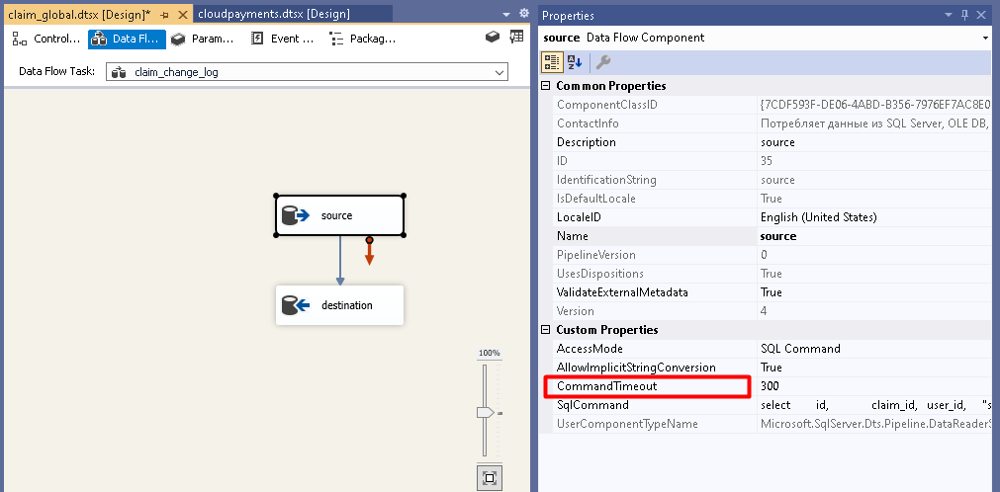

### [Заметки по SSIS](./../SSIS_note.md)

## Error: statement timeout

Для компонента ADO NET Source и драйвера ODBC следует изменить значение свойства CommandTimeout

### Полезные ссылки:

- [postgresql-statement-timeout](https://stackoverflow.com/questions/53295322/postgresql-statement-timeout)
- [sql.ru - ssis-istochnik-postgresql](https://www.sql.ru/forum/1284576/ssis-istochnik-postgresql)
- [Postgres Query Timing out after 30 Seconds](https://windows-hexerror.linestarve.com/q/so61108509-postgres-query-timing-out-after-30-seconds)