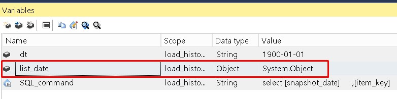
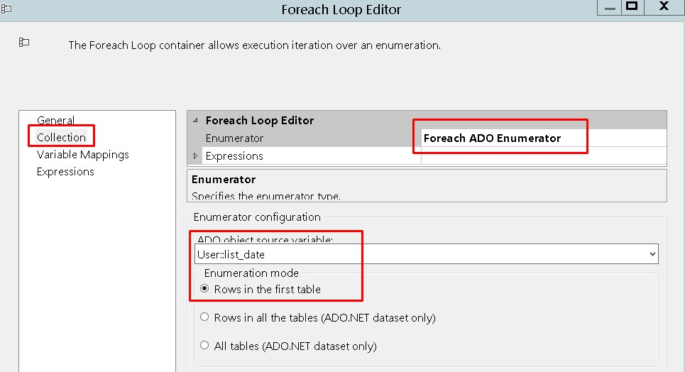
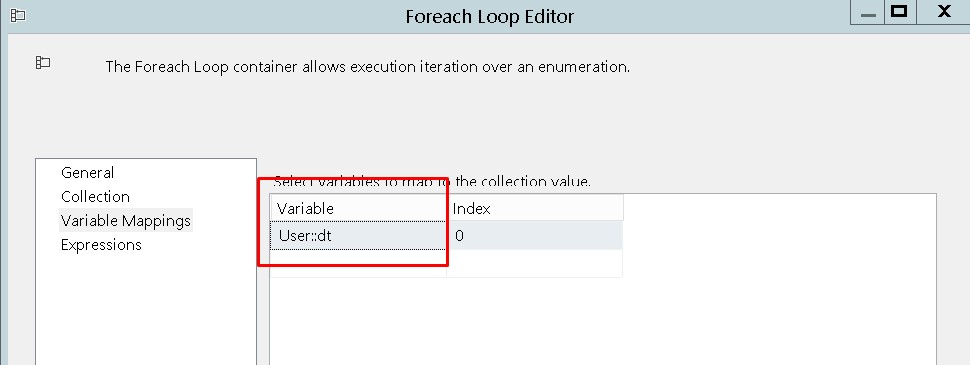
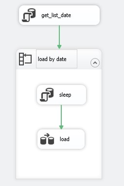
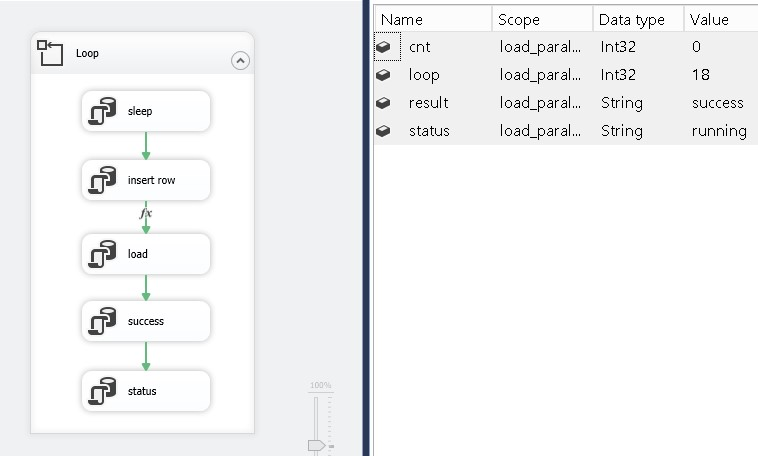

## Загрузка больших объемов данных

*[Синтаксис MarkDown](https://www.markdownguide.org/basic-syntax/)*  
[Заметки по SSIS](../SSIS_note.md)  

### Описание проблемы

Иногда загрузка исторических данных длится очень долго. В результате пакет падает или зависает.

### Варианты Решения

Задачу загрузки больших данных можно разбить на две

- Организация загрузки по частям
- Организация параллельной загрузки

### Реализация. Организация загрузки по частям

Для решения первой задачи нужно выбрать столбец по которому данные распределены равномерно. И организовать загрузку по этим значениям. Часто это бывает дата. В нашем случае - snapshot_date

Запрос для получения списка дат, результат которого помещаем в переменную типа Object

```sql
declare @st date = (select min([snapshot_date]) from [MDWH].[core].[items_collections_places_snapshot]),
		@fin date = getdate()

;with cte_month as
(
select 1 as iter, dateadd(day, 1, eomonth(@st, -1)) as dt
union all 
select iter + 1 as iter, dateadd(month, 1, dt) as dt
from cte_month
where dateadd(month, 1, dt) < @fin
)
select dt
from cte_month
order by dt
OPTION (MAXRECURSION 10000)
```



Далее настроим контейнер ForEach 



Определим переменную для итераций



Так как данные могут грузиться днями, то нужно предусмотреть окна для работы сервера по обновлению данных. Сделаем это с помощью запроса

```sql
if datepart(hh, getdate()) < 9
	waitfor time '09:00:00'
```

В итоге получается такой пакет



### Реализация. Организация параллельной загрузки

Для организации параллельной загрузки нужно разработать диспетчер, который будет записывать какой процесс какие данные грузит. В качестве такого диспетчера сделаем таблицу со следующей структурой

```sql
create table tempdb.dbo.map_of_tasks (
	id int not null identity (1, 1),
	ExecutionInstanceGUID nvarchar(128),
	task_id int,
	insert_dt datetime,
	result nvarchar(128)
)
```

Для логирования процесса создадим таблицу load_log

```sql
create table tempdb.dbo.load_log (
	id int not null identity (1, 1),
	task_id int,
	date_from date,
	date_to date,
	insert_dt datetime,
	result nvarchar(128)
)
```

Теперь создадим пакет SSIS для параллельного запуска



[Процедура для вставки задачи](./source/insert_map_of_tasks.sql.md) - общая, [для загрузки данных](./load_table.sql) - для каждого случая своя.

Запуск пакета для параллельной загрузки

```sql
-- Пользователь из под которого работает SQL Agent
execute as login = 'CORP\msamir-sdb-005$'

declare @cnt_parall_process int = 2, @iter int = 0

while @iter < @cnt_parall_process
begin 
	declare @execution_id bigint,
			@msg nvarchar(max)

	exec SSISDB.catalog.create_execution
		@package_name = N'load_parallel.dtsx',
		@folder_name = N'Load',
		@project_name = N'Load_Big_Data',
		@use32bitruntime = false,
		@reference_id = null,
		@execution_id = @execution_id output

	exec [catalog].[set_execution_property_override_value]
		@execution_id,
		@property_path = N'\Package.Variables[User::loop]',
		@property_value = 26,
		@sensitive = 0

	exec SSISDB.catalog.start_execution
		@execution_id

	select @execution_id

	set @iter = @iter + 1
end
```

Дополнительно можно реализовать отключение параллельных процессов, если нагрузка на сервер станет слишком велика. Реализовать это можно через дополнительное поле status в таблице map_of_tasks. Отключить процесс работы SSIS пакета можно и с помощью процедуры [SSISDB].[catalog].[stop_operation].

### Реализация. Загрузка INSERT INTO…SELECT для массового импорта данных с минимальным ведением журнала и параллелизмом

> Для минимального протоколирования этой инструкции необходимо выполнение следующих требований.
>
> - Модель восстановления базы данных настроена на простое или неполное протоколирование.
> - Целевой таблицей является пустая или непустая куча.
> - Целевая таблица не используется в репликации.
> - Для целевой таблицы используется указание `TABLOCK`.

### Реализация. Создание выровненного партиционированного индекса.

Воспользуемся пакетом параллельной загрузки. Перепишем процедуру загрузки данных на создание индекса. Процедура для создания индекса - [create_index.sql](./source/create_index.sql.md)

### Исходный код  

- Инициализация вспомогательных таблиц - [init.sql](./source/init.sql.md)  
- Процедура для вставки задачи - [insert_map_of_tasks.sql](./source/insert_map_of_tasks.sql.md)  
- Процедура для загрузки данных - [load_table.sql](./source/load_table.sql.md)  
- Скрипт для параллельного запуска SSIS пакетов - [start_execution.sql](./source/start_execution.sql.md)  

### Полезные ссылки:  

- [Предыдущие выпуски SQL Server Data Tools (SSDT и SSDT-BI)](https://docs.microsoft.com/ru-ru/sql/ssdt/previous-releases-of-sql-server-data-tools-ssdt-and-ssdt-bi?view=sql-server-ver15#ssdt-for-visual-studio-vs-2017)  
- [Заметки о выпуске SQL Server Management Studio (SSMS)](https://docs.microsoft.com/ru-ru/sql/ssms/release-notes-ssms?view=sql-server-ver15#previous-ssms-releases)  
- [Moving the SSISDB Catalog on a new SQL Server instance](https://www.sqlshack.com/moving-the-ssisdb-catalog-on-a-new-sql-server-instance/)  
- [SQL Server Table Partitioning: Resources](https://www.brentozar.com/sql/table-partitioning-resources/)  
- [Инструкция INSERT](https://docs.microsoft.com/ru-ru/sql/t-sql/statements/insert-transact-sql?view=sql-server-ver15)  
- [Выполнение пакета служб SSIS из SSMS с помощью Transact-SQL](https://docs.microsoft.com/ru-ru/sql/integration-services/ssis-quickstart-run-tsql-ssms?view=sql-server-ver15)  
- [Execute SSIS Package Using T SQL](http://www.intellectsql.com/post-execute-ssis-package-using-tsql/)  
