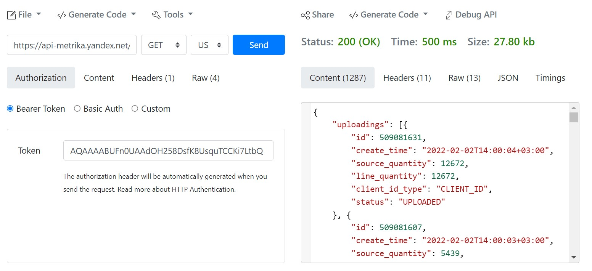

# Использование Postman для написания запросов к API Client

Для проверки запросов можно использовать [Online REST & SOAP API Testing Tool](https://reqbin.com/)

Например нужно проверить загрузку данных в https://api-metrika.yandex.net  
Для этого используем запрос для получения всех загрузок 
```http
https://api-metrika.yandex.net/management/v1/counter/42694559/offline_conversions/uploadings
```

где ym_counter = 42694559  
В Headers нужно указать token:  
ym_token = "AQAAAABUFn0UAAdOH258DsfK8UsquTCCKi7LtbQ"  



Расшифровка статусов загрузки
> - LINKAGE_FAILURE — не удалось сопоставить ни один идентификатор посетителя.  
> - PROCESSED — загрузка успешно обработана.  
> - UPLOADED — загрузка завершена.  
>

Полезные ссылки:

- [Метод POST](https://developer.mozilla.org/ru/docs/Web/HTTP/Methods/POST)  
- [Введение в Postman](https://habr.com/ru/company/kolesa/blog/351250/)  
- [Yandex - Список загрузок офлайн-конверсий](https://yandex.ru/dev/metrika/doc/api2/management/offline_conversion/findall.html)   