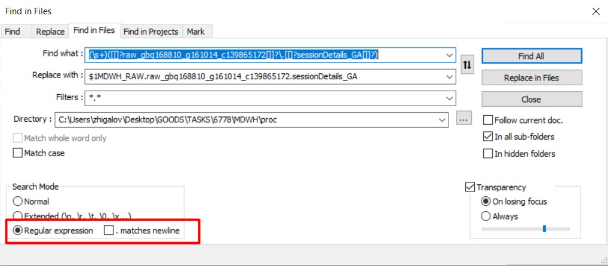

## Заметки по Регулярным выражениям  

### Пример использования в NotePad++

Нужно поменять название таблицы в нескольких процедурах.
- Включим использование регулярных выражений в NotePad++  
    

- допустим нужно добавить название БД **MDWH_RAW** в таблице  **raw_gbq168810_g161014_c139865172.sessionDetails_GA**, тогда шаблон для поиска будет

  ```sql
  (\s+)([[]?raw_gbq168810_g161014_c139865172[]]?\.[[]?sessionDetails_GA[]]?)
  ```

  ведущий пробельный символ добавлен для того, чтобы не добавить имя БД повторно.

  Шаблон для замены будет

  ```sql
  $1MDWH_RAW.raw_gbq168810_g161014_c139865172.sessionDetails_GA
  ```

  или если нужно оставить название таблицы как было

  ```sql
  $1MDWH_RAW.$2
  ```

- Другой пример. Нужно поменять название таблицы MDWH_CORE.core.order_create_dt на MDWH_CORE.core.order_x_create_dt, тогда шаблон для поиска будет  

  ```sql
  (\s+)([[]?MDWH_CORE[]]?\.[[]?core[]]?\.[[]?order_create_dt[]]?)(\s+|\b)
  ```

  Шаблон для замены будет  

  ```sql
  $1MDWH_CORE.core.order_x_create_dt$3
  ```

  

### Полезные ссылки:  

- [Регулярные выражения *Фридл Дж* 2018.pdf - **senior**](./Регулярные выражения__Фридл Дж__2018.pdf)  
- [Mastering_Regular_Expressions *Jeffrey Friedl* 2006.pdf](./Mastering_Regular_Expressions__Jeffrey Friedl__2006.pdf)  
- [Регулярные выражения. Сборник рецептов *Ян Гойвертс* 2015.djvu - **middle**](./Регулярные выражения. Сборник рецептов__Ян Гойвертс__2015.djvu)  
- [Regular Expressions Cookbook *Jan Goyvaerts* 2012.pdf](./Mastering_Regular_Expressions__Jeffrey Friedl__2006.pdf)  
- [Регулярные выражения. Основы *Майкл Фицджеральд* 2015.pdf - **junior**](./Регулярные выражения. Основы__Майкл Фицджеральд__2015.pdf)   
- [RegexOne - Learn Regular Expressions with simple, interactive exercises](https://regexone.com/)  
- [wiki - Регулярные выражения](https://ru.wikipedia.org/wiki/Регулярные_выражения)  
- [Cервис для тестирования и отладки - regex101.com](https://regex101.com/)  
- [Регулярные выражения в Python](https://habr.com/ru/post/349860/)  
- [Регулярные выражения в notepad++](https://romapad.ru/regulyarnye-vyrazheniya-v-notepad/)  
- [Регулярные выражения в notepad++ обозначения](https://web-ptica.ru/blog/14-obuchenie/notepad/60-regulyarnye-vyrazheniya-v-bloknote-notepad)  
